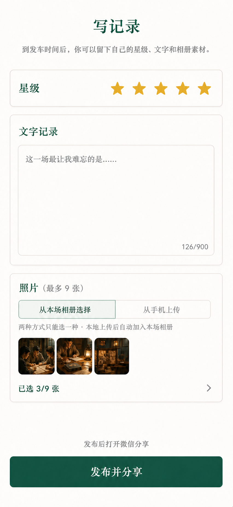

# 车局游后感设计确认

日期：2026-07-19

状态：用户已确认第三版界面，进入实现

## 已确认结论

- 每位符合资格的玩家每场保留一条综合游后感，不拆角色评价和剧本评价。
- 内容只有 1–5 星、最多 900 字自由文字、最多 9 张照片。
- 不做标签、分项评分、固定问题、视频或互动功能。
- 照片来源为“从本场相册选择”和“从手机上传”二选一；手机上传复用本场相册链路，所以新评价最终只引用相册照片。
- 发布后进入一条评价的只读分享页，可使用微信原生能力分享给好友、群聊和朋友圈。
- 在当前“写记录”页面上增量修改，延续现有暖白、深绿、金色星级和固定底部主按钮的视觉语言。

## 视觉基准

## 实施文档

- 产品需求：`specs/d49-session-review-experience/requirements.md`
- 技术设计：`specs/d49-session-review-experience/design.md`
- 执行清单：`specs/d49-session-review-experience/tasks.md`
- 实施计划：`docs/superpowers/plans/2026-07-19-session-review-experience.md`
